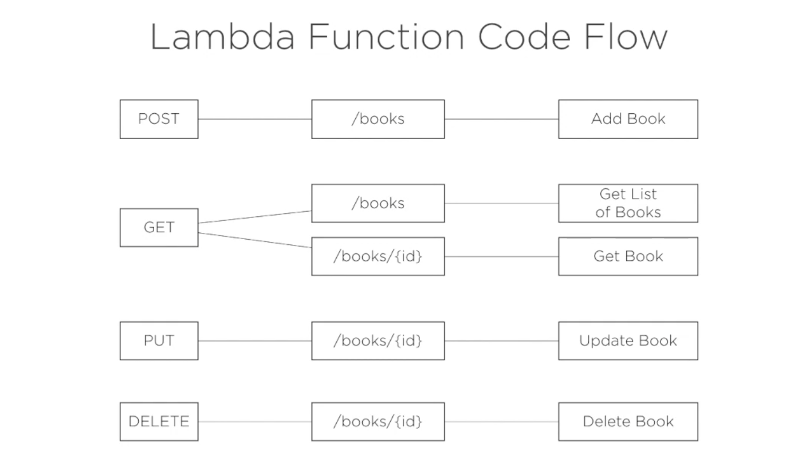
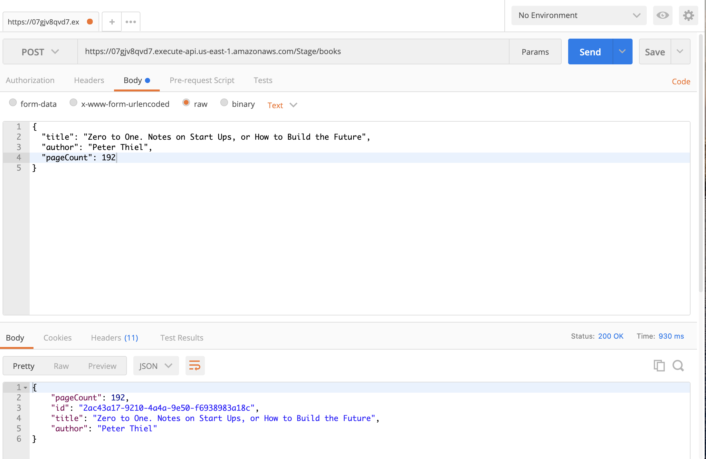
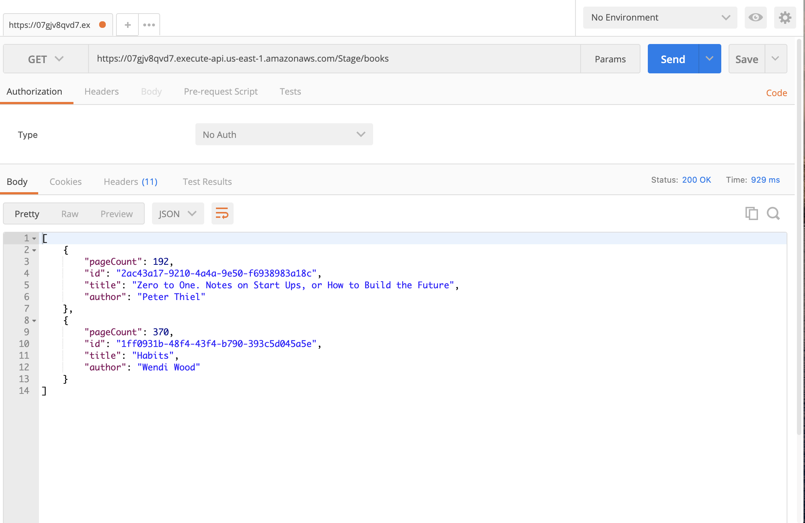
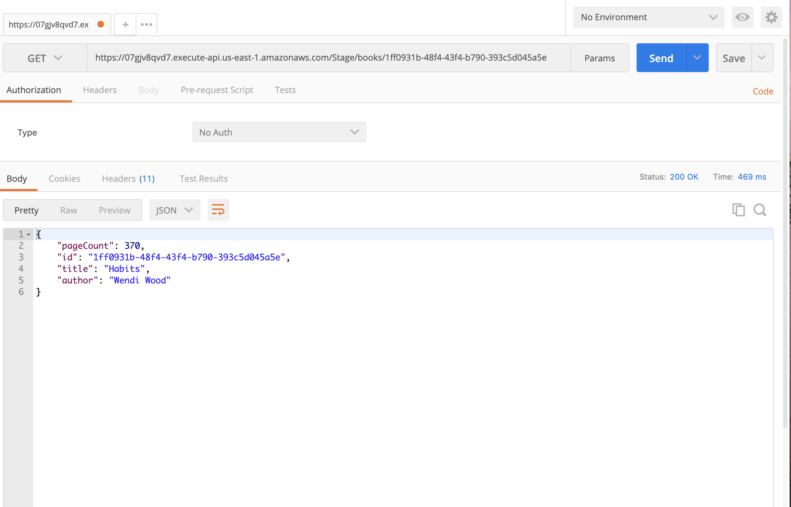
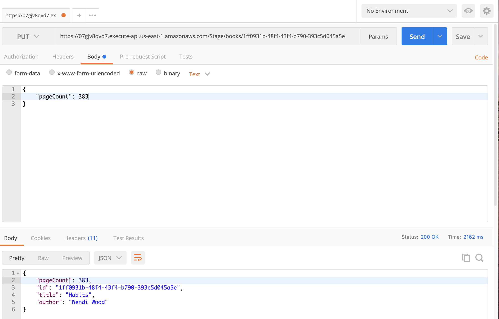
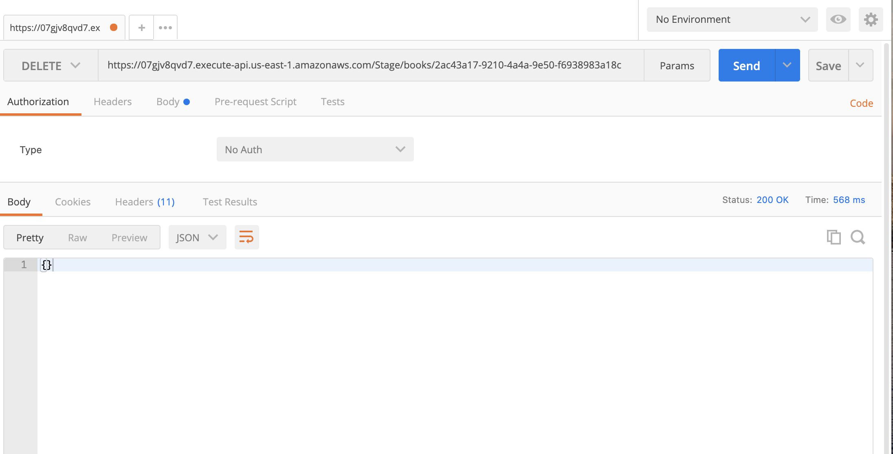

## Example how to create api based on ApiGateway and Lambda with CRUD operations on DynamoDB Table.

### Schema



## Steps to recreate:

Clone this repo.

Create S3 bucket via console or in terminal:
```
aws s3 mb s3://<bucket_name=pluralsight-books>
```

The two commands below will package artifacts to the S3 bucket and create: Stack - library and all resources described in sam-template.yaml.

```
sam package \
    --template-file sam-template.yaml \
    --s3-bucket pluralsight-books \
    --output-template-file sam-output-template.yaml
```
```
sam deploy \
    --template-file sam-output-template.yaml \ --stack-name library \
    --capabilities CAPABILITY_IAM
```
We can also use extension for working with Amazon Web Services - AWS Toolkit (in VS Code or other editors).
A good example in this video:
https://www.youtube.com/watch?v=ld9FmI5-h8U

## Testing
### Add book


### Get list of books


### Get book


### Update book


### Delete book



### Afterwords:
This example was taken from the course on Pluralsight - https://app.pluralsight.com/library/courses/224e022e-0d44-4f67-bc94-e5afde6ae393/table-of-contents
